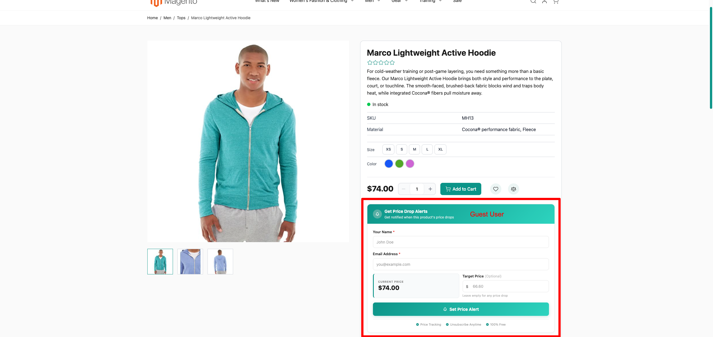
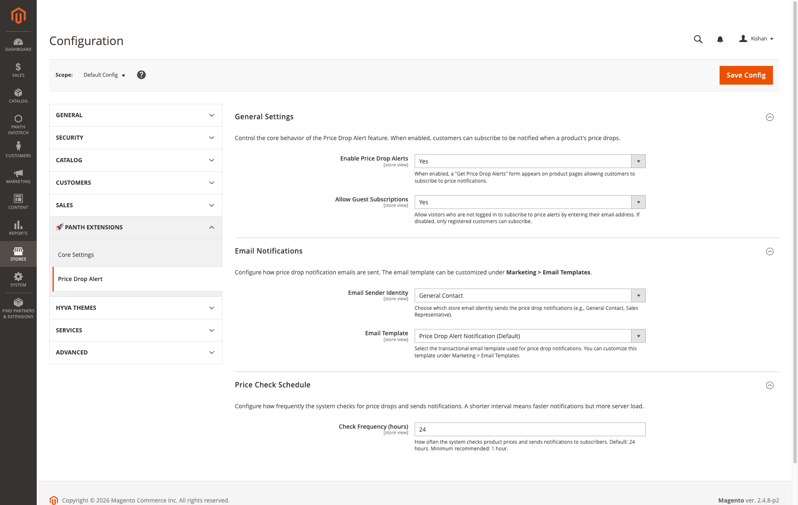
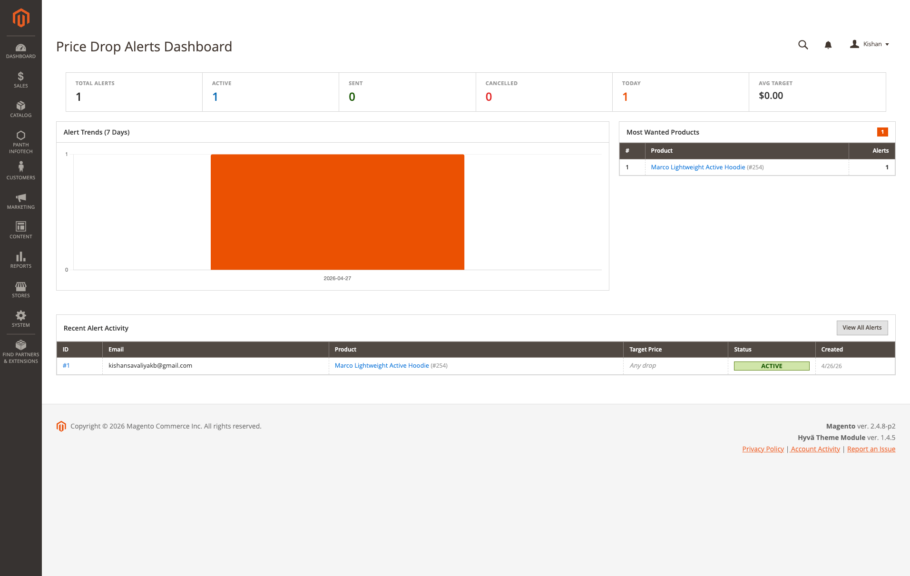
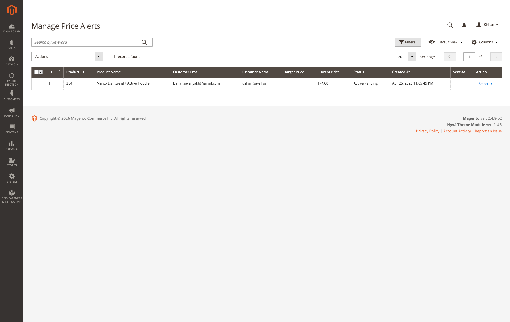
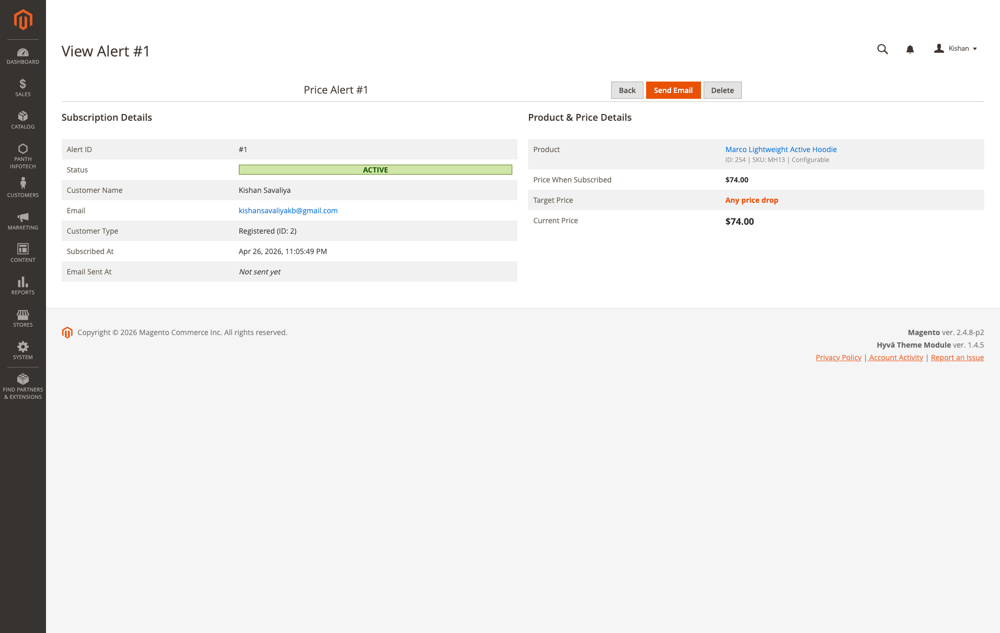

# Magento 2 Price Drop Alert

Price Drop Alert adds a "Get Price Drop Alerts" form to product pages. Shoppers, either guests or logged-in customers, subscribe with their name and email and can optionally set a target price. The module stores the price at the time of subscription, checks the current price by cron at the configured interval (24 hours by default) and immediately when an administrator saves a product with a changed price, and sends a transactional email when the price has dropped (or has reached the target price). Merchants get an admin dashboard, a "Manage Alerts" grid and a per-alert detail page with a manual "Send Email" action.

The module ships two storefront templates: an Alpine.js template for Hyva and a vanilla JavaScript template for Luma.

Product page: [kishansavaliya.com/magento-2-price-drop-alert.html](https://kishansavaliya.com/magento-2-price-drop-alert.html)



## Features

- Subscribe form on every product page, rendered after the price block (`product.info.main` on Luma, `product.info.additional` on Hyva).
- Guest subscriptions with name and email; logged-in customers subscribe with their account email and name.
- Optional target price per subscription. Without a target price any drop below the subscribed price triggers the email; with a target price the email is sent when the current price is at or below the target.
- Duplicate protection: one active alert per product and email address.
- Subscriptions are only accepted for products that are enabled, visible in the catalog or search and assigned to the current website.
- AJAX status check, subscribe and unsubscribe without a page reload.
- Per-IP rate limit on the subscribe and unsubscribe endpoints (configurable, HTTP 429 when exceeded).
- Tokenized unsubscribe link in every notification email.
- Price resolution per product type: final price for simple and other types, lowest child final price for configurable products, minimal final (or regular) price for bundle products, lowest associated product price for grouped products.
- Cron job that checks active alerts in batches of 500 at the configured interval.
- Observer on `catalog_product_save_after` that checks alerts right away when `price`, `special_price`, `special_from_date` or `special_to_date` changed; for a simple product its configurable parents are checked too.
- Transactional email "Price Drop Alert Notification" with old price, new price, discount percentage and a link to the product; sender identity and template selectable in configuration.
- Admin dashboard with total, active, sent and cancelled counts, today's counts, average target price, a 7-day trend chart, the most wanted products and recent activity.
- "Manage Alerts" grid with filters, a keyword search (customer email, customer name, product name, or the product ID when the keyword is a number), row actions (View, Delete, Send Email) and mass actions (Delete, Send Email).
- Alert detail page comparing subscribed price, target price and current price, with "Send Email" and "Delete" buttons.
- Declarative database schema (`etc/db_schema.xml`) and ACL resources for every admin action.

## Compatibility

| Platform | Versions |
|---|---|
| Magento Open Source | 2.4.4, 2.4.5, 2.4.6, 2.4.7, 2.4.8 |
| Adobe Commerce | 2.4.4, 2.4.5, 2.4.6, 2.4.7, 2.4.8 |
| PHP | 8.1, 8.2, 8.3, 8.4 |
| Themes | Hyva (Alpine.js template), Luma (vanilla JavaScript template) |

Composer constraints on Magento packages: `magento/framework` ^103.0, `magento/module-catalog` ^104.0, `magento/module-configurable-product` ^100.4, `magento/module-customer` ^103.0, `magento/module-email` ^101.0, `magento/module-config` ^101.0, `magento/module-store` ^101.0, `magento/module-backend` ^102.0, `magento/module-ui` ^101.0.

## Requirements

- Magento Open Source or Adobe Commerce 2.4.4 to 2.4.8
- PHP ~8.1.0, ~8.2.0, ~8.3.0 or ~8.4.0
- `mage2kishan/module-core` ^1.0 (module `Panth_Core`, required; it provides the parent admin menu)
- Magento cron must be running for the scheduled price check
- The Hyva template uses `hyva.getFormKey()` and Alpine.js, both provided by the Hyva theme

No other packages are suggested by `composer.json`.

## Installation

```bash
composer require mage2kishan/module-price-drop-alert
bin/magento module:enable Panth_Core Panth_PriceDropAlert
bin/magento setup:upgrade
bin/magento setup:di:compile
bin/magento cache:flush
```

`setup:di:compile` is only required in production mode. In production mode run `bin/magento setup:static-content:deploy` for the admin area so the bundled Chart.js file (`view/adminhtml/web/js/lib/chart.umd.min.js`) is published.

Check that the module is enabled:

```bash
bin/magento module:status Panth_PriceDropAlert
```

## Configuration

Admin path: Stores > Configuration > Panth Extensions > Price Drop Alert. All settings can be set at default, website and store view scope.



### General Settings

| Setting | Default | What it does |
|---|---|---|
| Enable Price Drop Alerts | Yes | Shows the subscribe form on product pages, enables the AJAX endpoints and lets the product-save observer send alerts. When set to No, the form is not rendered and the endpoints answer with "Price alerts are disabled." |
| Allow Guest Subscriptions | Yes | When set to No, the subscribe endpoint rejects guest submissions with "Please sign in to subscribe to price alerts.". The form is still rendered for guests because the page can be served from full page cache. |

### Email Notifications

| Setting | Default | What it does |
|---|---|---|
| Email Sender Identity | General Contact | Store email identity used as the sender of the notification. |
| Email Template | Price Drop Alert Notification | Transactional template used for the notification. Editable under Marketing > Email Templates. |

### Price Check Schedule

| Setting | Default | What it does |
|---|---|---|
| Check Frequency (hours) | 24 | Digits only, minimum 1. The cron job is scheduled hourly and skips a run until this many hours have passed since the last check (read at default scope; the last run time is stored in the `flag` table as `pricedropalert_last_run`). |

### Design & Colors

This group has no fields. Its comment points to a Tailwind theme configuration file (`app/design/frontend/Panth/Infotech/web/tailwind/theme-config.json`, section `modules.price-drop-alert`) for the CSS variables `--pricedropalert-primary`, `--pricedropalert-btn-from`, `--pricedropalert-btn-to`, `--pricedropalert-box-border` and `--pricedropalert-heading` that the storefront templates use. Both templates fall back to built-in colors when the variables are not defined.

### Abuse Protection

| Setting | Default | What it does |
|---|---|---|
| Requests per Window | 10 | Maximum number of subscribe or unsubscribe requests (counted separately) one client IP address may send per window. Further requests get HTTP 429 with "Too many requests. Please try again later.". 0 disables the limit. |
| Window Length (seconds) | 600 | Length of the fixed rate limit window. |

Counters are kept in the Magento cache. The client IP is read with `Magento\Framework\HTTP\PhpEnvironment\RemoteAddress`, so behind a proxy or load balancer configure the trusted forwarded-for headers (`x-forwarded-for` and similar) in `app/etc/env.php`; otherwise all visitors share the proxy's address.

Configuration paths:

- `pricedropalert/general/enabled`
- `pricedropalert/general/allow_guests`
- `pricedropalert/email/sender`
- `pricedropalert/email/email_template`
- `pricedropalert/cron/frequency`
- `pricedropalert/security/rate_limit`
- `pricedropalert/security/rate_limit_window`

Admin menu entries (under the "Panth Extensions" menu provided by `Panth_Core`): "Price Drop Alerts" > "Dashboard" (`pricedropalert/dashboard/index`), "Manage Alerts" (`pricedropalert/alert/index`) and "Configuration" (opens the section above).

## Usage

### Subscribing on the product page

The block is only rendered when the module is enabled, the product has a resolvable price greater than zero, and the layout handle `catalog_product_view` is loaded. On page load the template calls `pricedropalert/alert/status` to find out whether an active alert already exists for the product and email; if it does, a "Price Alert Active" card with the current price, the target price (if any) and a "Remove" button is shown instead of the form.

- Guests fill in "Your Name" and "Email Address" (both required) and optionally a "Target Price".
- Logged-in customers see their account email; name and email are taken from the customer session on the server, and the form only asks for the optional target price.
- A target price must be greater than zero and lower than the current price. The form shows the price in the shopper's display currency; a target price entered in a display currency is converted to the base currency before it is compared and stored.
- The form posts to `pricedropalert/alert/price`. The server records the product, email, name, store view, the price returned by `Model\PriceResolver` at that moment as the subscribed price and the optional target price (`trigger_price` or `target_price` parameter), with status "Active/Pending". A second active subscription for the same product and email is not stored again; logged-in customers get "You are already subscribed", guests get the normal success message so the response does not reveal whether an email address is subscribed.
- Guests can only see and remove alerts created in their current browser session. The status and unsubscribe endpoints ignore the `email` parameter for guests.

On Hyva the Alpine.js component also reads the `customer` section data from `mage-cache-storage` to detect a logged-in customer, so the block works on pages served from full page cache.

### How price drops are detected

`Model\PriceResolver` returns the price that is compared:

- simple, virtual, downloadable and other types: final price, falling back to the regular price when the final price is zero;
- configurable: minimal final price from the price info, falling back to the lowest final price of the enabled child products;
- bundle: minimal final price, then minimal regular price, then the simple-product rule;
- grouped: lowest final (or regular) price of the associated products.

An alert is sent when:

- a target price is set and the current price is less than or equal to the target price, or
- no target price is set and the current price is lower than the subscribed price.

Alerts with a current price of zero are skipped, as are alerts of store views where the module is disabled. Prices are resolved for the alert's store view. For alerts of registered customers the price is calculated for the customer's current customer group (tier and group prices and group-specific catalog price rules apply; bundle products use the default price info). Guest alerts use the NOT LOGGED IN price. After a successful send the alert status changes to "Sent/Notified" and `sent_at` is recorded; sent alerts are not checked again.

Two triggers run this check:

1. Cron job `pricedropalert_price_alert` (group `default`, schedule `0 * * * *`, class `Cron\PriceAlertNotification`). It runs when the configured Check Frequency has elapsed, loads active alerts in batches of 500 and logs how many were checked and sent.
2. Observer `Observer\ProductSaveAfterCheckAlerts` on `catalog_product_save_after`. When the saved product's `price`, `special_price`, `special_from_date` or `special_to_date` changed, it checks the active alerts for that product (and, for a simple product, for its configurable parents) and sends emails immediately.

### Email content

The notification uses the template "Price Drop Alert Notification" (`pricedropalert_email_email_template`, file `view/frontend/email/price_alert.html`, frontend area). Subject: "Great news! {{var product_name}} just dropped in price". Available variables: `customer_name`, `product_name`, `product_url`, `product_price`, `old_price`, `new_price`, `old_price_formatted`, `new_price_formatted`, `discount_percent`, `unsubscribe_url` and `store`. The template shows the price when subscribed, the current price, the savings percentage, a "Shop Now" button linking to the product and an "Unsubscribe from price drop alerts" link (`unsubscribe_url`). The email is sent with the sender identity and template configured for the alert's store view. The default template shows `old_price_formatted` and `new_price_formatted`, which are converted to and formatted in the store view's default display currency. `product_price`, `old_price` and `new_price` are plain numbers with two decimals and no currency symbol.

### Unsubscribing

Subscribers unsubscribe from the product page with the "Remove" button, which posts to `pricedropalert/alert/unsubscribe` and deletes the active alert row for that product and the customer's email (logged-in customers) or for the alerts created in the current browser session (guests). Every notification email also contains an unsubscribe link, `pricedropalert/unsubscribe/index/id/<alert id>/token/<token>`. The token is a random 32-character value generated when the alert is saved and stored in `unsubscribe_token`. Opening the link with the correct token sets every active alert of that email address in that store view to "Cancelled" and redirects to the home page with a confirmation message; a wrong or missing token shows "This unsubscribe link is invalid or has expired." and changes nothing. The link is rate limited like the other endpoints. Custom email templates created before version 1.1.0 need `{{var unsubscribe_url}}` added. Administrators can delete alerts from the grid or the detail page.

### Admin dashboard

Price Drop Alerts > Dashboard shows total, active, sent and cancelled alert counts, alerts created and emails sent today, the average target price of active alerts, an "Alert Trends (7 Days)" chart (Chart.js 4.5.0 bundled with the module in `view/adminhtml/web/js/lib/chart.umd.min.js`, MIT license in `LICENSE-chartjs.txt` next to it; nothing is loaded from a CDN), a "Most Wanted Products" table (top products by active alert count) and "Recent Alert Activity".



### Manage Alerts grid

Price Drop Alerts > Manage Alerts lists all alerts with the columns ID, Product Name, Customer Email, Target Price, Current Price (resolved live), Status and Created At; Product ID, Customer Name and Sent At are available from the Columns menu. It offers a keyword search (customer email, customer name, product name, or the product ID when the keyword is a number), filters (including a Status filter with "Active/Pending", "Sent/Notified" and "Cancelled"), the row actions View, Delete and Send Email, and the mass actions Delete and Send Email. The grid has no inline editor.



The alert detail page (View) shows subscription details, customer type (registered or guest), the product, the price when subscribed, the target price, the current price and a message stating whether the price has dropped or how far it is from the target. "Send Email" sends the notification for that alert immediately, regardless of the current price, and marks it "Sent/Notified".



### Cron jobs

| Job | Schedule | Class |
|---|---|---|
| `pricedropalert_price_alert` | `0 * * * *` (hourly, group `default`; checks run at the configured Check Frequency) | `Panth\PriceDropAlert\Cron\PriceAlertNotification::execute` |

The module registers no console commands.

## Developer Notes

- Module name: `Panth_PriceDropAlert`; Composer package: `mage2kishan/module-price-drop-alert`; PHP namespace: `Panth\PriceDropAlert`.
- Load sequence: after `Panth_Core`, `Magento_Catalog`, `Magento_Customer`, `Magento_Email` and `Magento_Config`.
- Frontend route `pricedropalert`: `Controller\Alert\Price` (POST, subscribe), `Controller\Alert\Status` (GET, JSON status), `Controller\Alert\Unsubscribe` (POST). All three return JSON. `Controller\Unsubscribe\Index` (GET, token unsubscribe link from the email) redirects to the home page.
- `Model\RateLimiter` implements the per-IP limit (cache keys prefixed `panth_pricedropalert_rl_`).
- Admin route `pricedropalert`: `Controller\Adminhtml\Dashboard\Index`, `Controller\Adminhtml\Alert\Index`, `View` (GET), `Delete`, `MassDelete`, `Send`, `MassSend` (POST only).
- Key classes: `Helper\Data` (config accessors), `Model\PriceAlert` (status constants `STATUS_ACTIVE` = 1, `STATUS_SENT` = 2, `STATUS_CANCELLED` = 3; event prefix `panth_price_alert`), `Model\ResourceModel\PriceAlert`, `Model\ResourceModel\PriceAlert\Collection`, `Model\PriceResolver` (price comparison logic), `Model\EmailSender::sendAlertEmail()`, `Cron\PriceAlertNotification`, `Observer\ProductSaveAfterCheckAlerts`, `Observer\AddPlacementLayoutHandle` (adds the `pricedropalert_placement_after_price` handle on `catalog_product_view`), `Block\PriceAlert` (storefront block), `Block\Adminhtml\Dashboard`, `Block\Adminhtml\Alert\View`, `ViewModel\PlacementProcessor`, `Model\Config\Source\Placement` and `Model\Config\Source\DisplayPosition` (option sources; the placement is currently fixed to `after_price`).
- Layouts: `view/frontend/layout/catalog_product_view.xml` adds block `product.price.alert` with the Luma template `luma/price-alert.phtml`; `view/frontend/layout/hyva_catalog_product_view.xml` (loaded only on Hyva themes) switches it to `price-alert.phtml` (Alpine.js) and moves it to `product.info.additional`. Additional `pricedropalert_placement_*.xml` layout files exist for other positions and can be used by adding the matching handle.
- Events: `catalog_product_save_after` (global) and `layout_load_before` (frontend).
- Data patch `Setup\Patch\Data\BackfillUnsubscribeTokens` fills `unsubscribe_token` for alerts created before 1.1.0.
- Email template id `pricedropalert_email_email_template` (`etc/email_templates.xml`).
- UI component `pricedropalert_alert_listing` with data source `pricedropalert_alert_listing_data_source` (virtual type `Panth\PriceDropAlert\Model\ResourceModel\PriceAlert\Grid\Collection`) and column classes under `Ui\Component\Listing\Column` (`ProductName`, `Email`, `CustomerName`, `CurrentPrice`, `Actions`).
- ACL resources: `Panth_PriceDropAlert::panth_pricedropalert` ("Price Drop Alert"), `Panth_PriceDropAlert::dashboard`, `Panth_PriceDropAlert::alerts`, `Panth_PriceDropAlert::alert_view`, `Panth_PriceDropAlert::alert_delete`, `Panth_PriceDropAlert::alert_send`, `Panth_PriceDropAlert::config`.
- Database table `panth_price_alert`: `alert_id` (PK), `customer_id` (FK to `customer_entity`, cascade delete), `product_id` (FK to `catalog_product_entity`, cascade delete), `email`, `customer_name`, `subscribed_price`, `target_price`, `store_id`, `status`, `created_at`, `sent_at`, `unsubscribe_token`; indexes on `customer_id`, `product_id`, `email` and `status`.

## Uninstallation

```bash
bin/magento module:disable Panth_PriceDropAlert
composer remove mage2kishan/module-price-drop-alert
bin/magento setup:upgrade
bin/magento setup:di:compile
bin/magento cache:flush
```

Disabling the module leaves the `panth_price_alert` table and the `pricedropalert/*` rows in `core_config_data` in place. Once the package is removed, `setup:upgrade` lets the declarative schema drop `panth_price_alert` because it is no longer declared, so export the table first if you need the subscriptions. Configuration values remain in `core_config_data` until deleted manually.

## Support

- Product page: [kishansavaliya.com/magento-2-price-drop-alert.html](https://kishansavaliya.com/magento-2-price-drop-alert.html)
- Contact form: [kishansavaliya.com/contact](https://kishansavaliya.com/contact)
- Email: kishansavaliyakb@gmail.com
- GitHub issues: [github.com/mage2sk/module-price-drop-alert/issues](https://github.com/mage2sk/module-price-drop-alert/issues)

## Documentation

[USER_GUIDE.md](USER_GUIDE.md) covers installation, verifying the module, each configuration group, the dashboard, managing and viewing alerts, how customers subscribe on Hyva and Luma, the cron job and product-save observer, email template customization and troubleshooting.

## License

Commercial software license. See [LICENSE.txt](LICENSE.txt) in this repository.

## Changelog

See [CHANGELOG.md](CHANGELOG.md).

## Links

- Website: [kishansavaliya.com](https://kishansavaliya.com)
- All extensions: [kishansavaliya.com/magento-extensions.html](https://kishansavaliya.com/magento-extensions.html)
- GitHub: [github.com/mage2sk/module-price-drop-alert](https://github.com/mage2sk/module-price-drop-alert)
- Packagist: [packagist.org/packages/mage2kishan/module-price-drop-alert](https://packagist.org/packages/mage2kishan/module-price-drop-alert)
